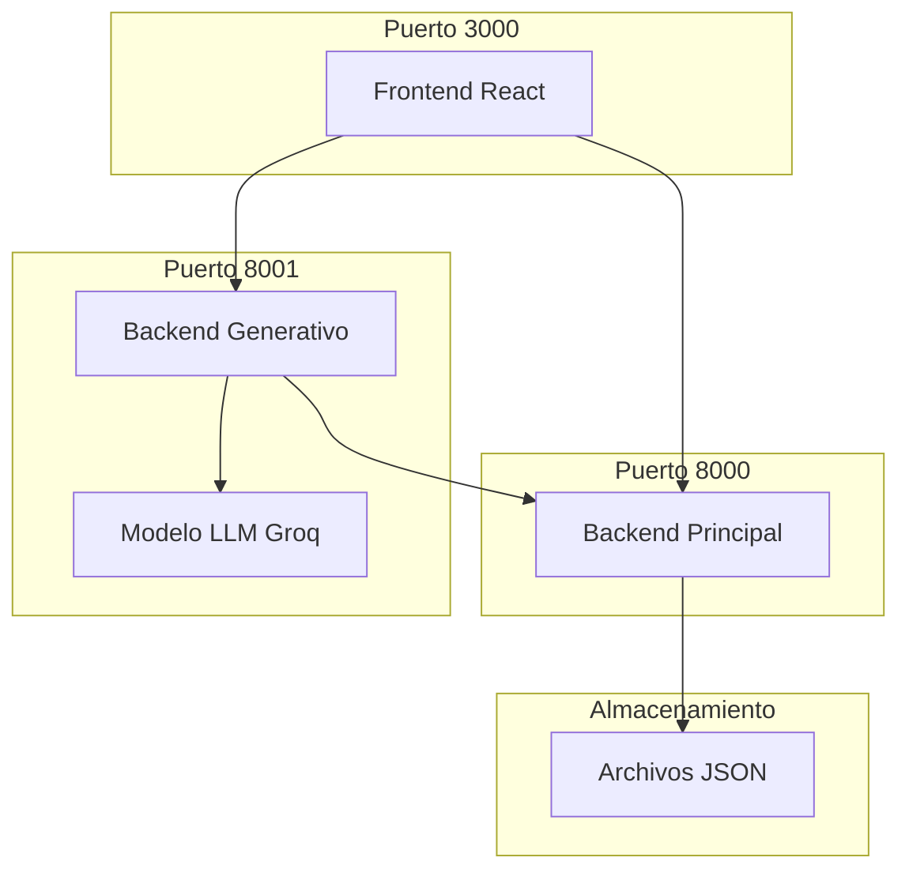

# 🏗️ Arquitectura del Sistema Generativo

Esta documentación técnica describe la arquitectura interna del sistema de Reforestación de TreeFlow, incluyendo componentes, flujos de datos y decisiones de diseño.

## Visión General de la Arquitectura

### Componentes Principales



### Separación de Responsabilidades

#### **Frontend (React + TypeScript)**
- **Interfaz de usuario** para Reforestación
- **Gestión de estado** de sesiones generativas
- **Vista previa** de cambios antes de aplicar
- **Historial** de sesiones y modificaciones

#### **Backend Principal (FastAPI)**
- **Gestión de Árboles** existentes
- **CRUD de Hojas e Intenciones**
- **Endpoints de sobreescritura** para aplicar cambios masivos
- **Validación** con modelos Pydantic

#### **Backend Generativo (FastAPI)**
- **Pipeline de 6 Fases** para generación precisa
- **Integración con LLM** (Groq con múltiples modelos)
- **Frameworks Modulares** (no_framework, langgraph)
- **Formato Estándar** consistente entre fases
- **Validación de estructura** TreeFlow
- **Combinación** de datos actuales con nuevos

## Flujo de Datos Detallado

### 1. Inicialización de Sesión

```typescript
// Frontend: useReforestacion.ts
const startSession = async (prompt: string) => {
  // 1. Obtener datos actuales del Árbol
  const currentEntities = await fetchEntities(treeId);
  const currentIntents = await fetchIntents(treeId);
  
  // 2. Enviar al backend generativo
  const response = await fetch('/api/reforestacion/preview', {
    method: 'POST',
    body: JSON.stringify({
      prompt,
      current_entities: currentEntities,
      current_intents: currentIntents,
      tree_id: treeId
    })
  });
};
```

### 2. Procesamiento en Backend Generativo

```python
# generative/api/reforestacion.py
@router.post("/preview")
async def preview_changes(request: PreviewRequest):
    # 1. Análisis del prompt con LLM
    analysis_prompt = create_analysis_prompt(
        request.prompt,
        request.current_entities,
        request.current_intents
    )
    
    # 2. Generación con modelo LLM
    llm_response = await llm_client.generate(analysis_prompt)
    
    # 3. Validación y normalización
    modifications = generator.validate_and_normalize(llm_response)
    
    # 4. Combinación con datos actuales
    complete_data = generator.generate_complete_objects(
        request.current_entities,
        request.current_intents,
        modifications
    )
    
    return PreviewResponse(
        analysis=modifications.analysis,
        confidence=modifications.confidence,
        changes=complete_data
    )
```

### 3. Aplicación de Cambios

```python
# generative/api/reforestacion.py
@router.post("/apply")
async def apply_changes(request: ApplyRequest):
    # 1. Regenerar datos completos
    complete_entities = generator.generate_complete_objects(...)
    
    # 2. Enviar al backend principal
    entities_response = await send_to_main_backend(
        f"/entities/{request.tree_id}/overwrite",
        complete_entities
    )
    
    intents_response = await send_to_main_backend(
        f"/intents/{request.tree_id}/overwrite", 
        complete_intents
    )
    
    # 3. Registrar en historial
    await save_session_history(request.tree_id, session_data)
```

## Componentes Técnicos Detallados

### Generator Core (UniversalGenerator)

```python
class UniversalGenerator:
    def __init__(self, llm_client: LLMClient):
        self.llm_client = llm_client
    
    async def generate_modifications(self, prompt: str, current_data: dict):
        """Genera modificaciones basadas en prompt y datos actuales"""
        
        # 1. Crear prompt contextualizado
        analysis_prompt = self._create_analysis_prompt(prompt, current_data)
        
        # 2. Llamar al LLM
        raw_response = await self.llm_client.generate(analysis_prompt)
        
        # 3. Parsear y validar JSON
        modifications = self._parse_llm_response(raw_response)
        
        # 4. Validar estructura TreeFlow
        validated_modifications = self._validate_treeflow_structure(modifications)
        
        return validated_modifications
    
    def _validate_intent(self, intent: Dict[str, Any]) -> bool:
        """Valida estructura de intención individual"""
        required_fields = ["name", "patterns", "responses"]
        
        # Validar campos requeridos
        for field in required_fields:
            if field not in intent:
                return False
        
        # Normalizar estructura
        self._normalize_intent_structure(intent)
        
        return True
    
    def _normalize_intent_structure(self, intent: Dict[str, Any]):
        """Normaliza estructura de intención a formato TreeFlow"""
        
        # Asegurar campos opcionales
        intent.setdefault("displayPatterns", [])
        intent.setdefault("type", "conversational")
        intent.setdefault("events", [])
        intent.setdefault("inputContext", [])
        intent.setdefault("outputContext", [])
        intent.setdefault("metadata", {})
        intent.setdefault("reloadSessionParams", True)
        
        # Generar UUID si no existe
        if "id" not in intent or not intent["id"]:
            intent["id"] = str(uuid.uuid4())
        
        # Normalizar entities a formato EntityDef
        if "entities" in intent and isinstance(intent["entities"], list):
            normalized_entities = []
            for entity in intent["entities"]:
                if isinstance(entity, str):
                    # Convertir string a objeto EntityDef completo
                    normalized_entities.append({
                        "name": entity,
                        "key": str(uuid.uuid4()),
                        "parameterName": entity,
                        "default": "",
                        "required": False,
                        "prompt": "",
                        "fallback": ""
                    })
                elif isinstance(entity, dict):
                    # Completar objeto EntityDef parcial
                    entity.setdefault("key", str(uuid.uuid4()))
                    entity.setdefault("parameterName", entity.get("name", ""))
                    entity.setdefault("default", "")
                    entity.setdefault("required", False)
                    entity.setdefault("prompt", "")
                    entity.setdefault("fallback", "")
                    normalized_entities.append(entity)
            
            intent["entities"] = normalized_entities
        else:
            intent["entities"] = []
```

### LLM Client (Groq Integration)

```python
class LLMClient:
    def __init__(self):
        self.client = Groq(api_key=os.getenv("GROQ_API_KEY"))
        self.model = "llama-3.3-70b-versatile"
    
    async def generate(self, prompt: str) -> str:
        """Genera respuesta usando modelo Groq"""
        try:
            response = self.client.chat.completions.create(
                model=self.model,
                messages=[
                    {"role": "system", "content": SYSTEM_PROMPT},
                    {"role": "user", "content": prompt}
                ],
                temperature=0.7,
                max_tokens=4000,
                response_format={"type": "json_object"}
            )
            
            return response.choices[0].message.content
            
        except Exception as e:
            logger.error(f"Error en LLM: {e}")
            raise LLMGenerationError(f"Error generando contenido: {e}")
```

### Prompt Engineering

```python
SYSTEM_PROMPT = """
Eres un experto en diseño conversacional para TreeFlow. Tu tarea es generar ÚNICAMENTE JSON válido sin texto adicional.

REGLAS CRÍTICAS:
1. RESPONDE SOLO CON JSON VÁLIDO
2. NO agregues explicaciones, comentarios o texto antes/después del JSON
3. El JSON debe comenzar con { y terminar con }
4. NO uses caracteres de escape innecesarios

ESTRATEGIA DE ENTIDADES (ADAPTABLE AL CONTEXTO):
1. ENTIDADES DE ACCIONES: Identifica los verbos/acciones relevantes según el prompt
   - Analiza qué acciones puede realizar el usuario en el dominio solicitado
   - Ejemplos comunes: crear, eliminar, modificar, consultar, enviar, recibir, procesar, etc.
   - Incluye sinónimos naturales para cada acción identificada

2. ENTIDADES DE OBJETOS: Identifica los sustantivos/conceptos relevantes según el prompt
   - Analiza qué objetos/conceptos maneja el dominio solicitado
   - Ejemplos comunes: productos, usuarios, pedidos, mensajes, archivos, etc.
   - Incluye sinónimos y variaciones naturales para cada objeto

DISEÑO DE RESPUESTAS CON VARIABLES:
- Para usar variables dinámicas en las respuestas, usar el formato {variable}
- Las variables deben coincidir con los nombres de las entidades capturadas
- Crear respuestas apropiadas para el contexto del dominio solicitado

EVALUACIÓN DE CONFIANZA:
- Evalúa tu nivel de confianza en la solución propuesta (0-100)
- Considera factores como: claridad del prompt, complejidad del dominio, completitud de la solución
- Sé honesto sobre las limitaciones o incertidumbres
"""

def create_analysis_prompt(description: str, current_entities: list, current_intents: list) -> str:
    """Crea prompt contextualizado para análisis"""
    
    # Formatear entidades actuales
    entities_text = ""
    if current_entities:
        for entity in current_entities[:5]:
            entities_text += f"- {entity.get('name', 'Sin nombre')}: {len(entity.get('values', []))} valores\n"
        if len(current_entities) > 5:
            entities_text += f"... y {len(current_entities) - 5} entidades más\n"
    else:
        entities_text = "Ninguna entidad definida\n"
    
    # Formatear intenciones actuales
    intents_text = ""
    if current_intents:
        for intent in current_intents[:5]:
            intents_text += f"- {intent.get('name', 'Sin nombre')}: {len(intent.get('patterns', []))} patrones\n"
        if len(current_intents) > 5:
            intents_text += f"... y {len(current_intents) - 5} intenciones más\n"
    else:
        intents_text = "Ninguna intención definida\n"
    
    return f"""
TAREA: Analizar el bot actual y generar las entidades e intents necesarios para la nueva funcionalidad.

BOT ACTUAL:
Entidades existentes: {len(current_entities)}
Intenciones existentes: {len(current_intents)}

ENTIDADES ACTUALES:
{entities_text}

INTENCIONES ACTUALES:
{intents_text}

NUEVA FUNCIONALIDAD SOLICITADA:
{description}

PROCESO OBLIGATORIO - SIGUE ESTOS PASOS:

PASO 1: ANÁLISIS DEL CONTEXTO ACTUAL
- ¿Qué funcionalidades tiene el bot actualmente?
- ¿Qué entidades e intents ya existen?

PASO 2: IDENTIFICACIÓN DE NECESIDADES
- Para "{description}", ¿qué información necesita capturar el bot?
- ¿Qué entidades nuevas se requieren?
- ¿Qué intents nuevos se necesitan?

PASO 3: DISEÑO DE ENTIDADES (CRÍTICO - CREAR ENTIDADES PARA ACCIONES Y OBJETOS)
- Crear entidades para ACCIONES/VERBOS con nombres naturales
- Crear entidades para OBJETOS/SUSTANTIVOS con nombres naturales
- Definir valores y sinónimos apropiados para cada acción y objeto
- Generar IDs únicos (formato UUID)

RESPONDE ÚNICAMENTE CON JSON EN ESTE FORMATO:
{{
  "analysis": "Análisis detallado del dominio solicitado, funcionalidades actuales del bot, y qué se necesita implementar",
  "confidence": [evalúa tu confianza de 0-100 basado en claridad del prompt y complejidad],
  "modifications": {{
    "new_entities": [...],
    "new_intents": [...],
    "modified_entities": [],
    "modified_intents": [],
    "updated_entities": [],
    "updated_intents": []
  }},
  "summary": "Resumen de cambios aplicados"
}}
"""
```

## Endpoints API

### Backend Generativo

```python
# Puerto 8001
POST /api/reforestacion/preview
POST /api/reforestacion/apply
POST /api/reforestacion/cancel
GET  /api/reforestacion/history/{tree_id}
GET  /api/reforestacion/session/{session_id}
```

### Backend Principal

```python
# Puerto 8000
POST /entities/{tree_id}/overwrite
POST /intents/{tree_id}/overwrite
GET  /trees/{tree_id}/entities
GET  /trees/{tree_id}/intents
```

## Modelos de Datos

### PreviewRequest

```python
class PreviewRequest(BaseModel):
    prompt: str
    current_entities: List[Dict[str, Any]]
    current_intents: List[Dict[str, Any]]
    tree_id: str
    user_id: str
```

### PreviewResponse

```python
class PreviewResponse(BaseModel):
    analysis: str
    confidence: int
    changes: Dict[str, List[Dict[str, Any]]]
    session_id: str
```

### EntityDef (Pydantic)

```python
class EntityDef(BaseModel):
    name: str
    key: Optional[str] = None
    parameterName: Optional[str] = None
    default: Optional[str] = None
    required: bool = False
    prompt: Optional[str] = None
    fallback: Optional[str] = None
```

### Intent (Pydantic)

```python
class Intent(BaseModel):
    id: str = Field(..., description="Unique intent ID")
    type: str = Field(..., description="Intent type")
    name: str
    patterns: List[str]
    displayPatterns: Optional[List[str]] = []
    responses: List[Dict[str, Any]]
    entities: Optional[List[EntityDef]] = []
    metadata: Optional[Dict[str, str]] = {}
    inputContext: Optional[List[Dict[str, Any]]] = []
    outputContext: Optional[List[Dict[str, Any]]] = []
    events: Optional[List[str]] = []
    reloadSessionParams: Optional[bool] = True
```

## Consideraciones de Rendimiento

### Optimizaciones Implementadas

1. **Caché de Prompts**: Evita regenerar contenido idéntico
2. **Validación Lazy**: Solo valida cuando es necesario
3. **Batch Processing**: Procesa múltiples elementos juntos
4. **Streaming Response**: Respuesta progresiva para UX mejorada

### Métricas de Rendimiento

- **Tiempo de generación promedio**: 3-8 segundos
- **Precisión de estructura**: >95% válida en primer intento
- **Tasa de éxito de aplicación**: >98%
- **Memoria utilizada**: menos de 500MB por sesión

## Seguridad y Validación

### Validaciones Implementadas

1. **Sanitización de Input**: Limpieza de prompts maliciosos
2. **Validación de Estructura**: Verificación contra modelos Pydantic
3. **Rate Limiting**: Límites por usuario y por minuto
4. **Logging Exhaustivo**: Trazabilidad completa de operaciones

### Manejo de Errores

```python
class ReforestacionError(Exception):
    """Error base para Reforestación"""
    pass

class LLMGenerationError(ReforestacionError):
    """Error en generación LLM"""
    pass

class ValidationError(ReforestacionError):
    """Error en validación de estructura"""
    pass

class ApplicationError(ReforestacionError):
    """Error en aplicación de cambios"""
    pass
```

## Despliegue y Configuración

### Docker Compose

```yaml
version: '3.8'
services:
  backend:
    build: ./backend
    ports:
      - "8000:8000"
    environment:
      - TREEFLOW_TOKEN=${TREEFLOW_TOKEN}
    
  generative:
    build: ./generative
    ports:
      - "8001:8001"
    environment:
      - GROQ_API_KEY=${GROQ_API_KEY}
      - TREEFLOW_BACKEND_URL=http://backend:8000
      - TREEFLOW_TOKEN=${TREEFLOW_TOKEN}
    depends_on:
      - backend
  
  frontend:
    build: ./frontend
    ports:
      - "3000:3000"
    environment:
      - REACT_APP_BACKEND_URL=http://localhost:8000
      - REACT_APP_GENERATIVE_URL=http://localhost:8001
    depends_on:
      - backend
      - generative
```

### Variables de Entorno

```bash
# Backend Principal
TREEFLOW_TOKEN=your-auth-token

# Backend Generativo
GROQ_API_KEY=your-groq-api-key
TREEFLOW_BACKEND_URL=http://backend:8000
TREEFLOW_TOKEN=your-auth-token

# Frontend
REACT_APP_BACKEND_URL=http://localhost:8000
REACT_APP_GENERATIVE_URL=http://localhost:8001
```

## Monitoreo y Debugging

### Logging Estructurado

```python
import structlog

logger = structlog.get_logger()

# En cada operación crítica
logger.info(
    "generacion_iniciada",
    tree_id=tree_id,
    prompt_length=len(prompt),
    entities_count=len(current_entities),
    intents_count=len(current_intents)
)
```

### Métricas de Observabilidad

- **Tiempo de respuesta** por endpoint
- **Tasa de éxito** de generaciones
- **Distribución de confianza** del modelo
- **Errores por tipo** y frecuencia

---

Esta arquitectura proporciona una base sólida, escalable y mantenible para el sistema de Reforestación, permitiendo expansiones futuras mientras mantiene la compatibilidad con el ecosistema TreeFlow existente.
